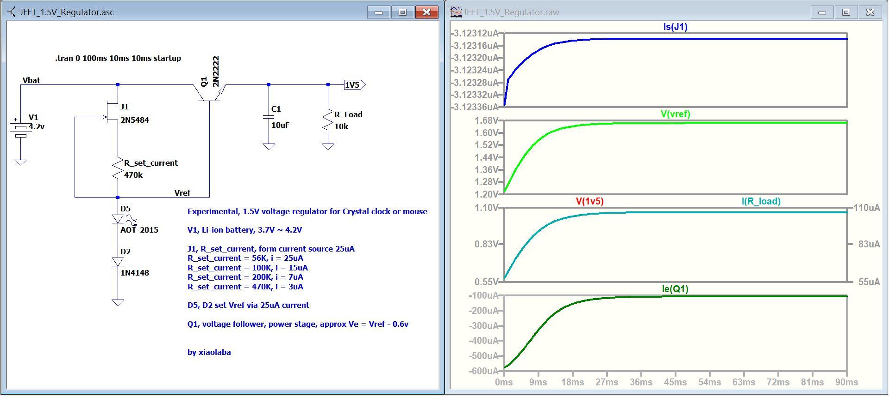
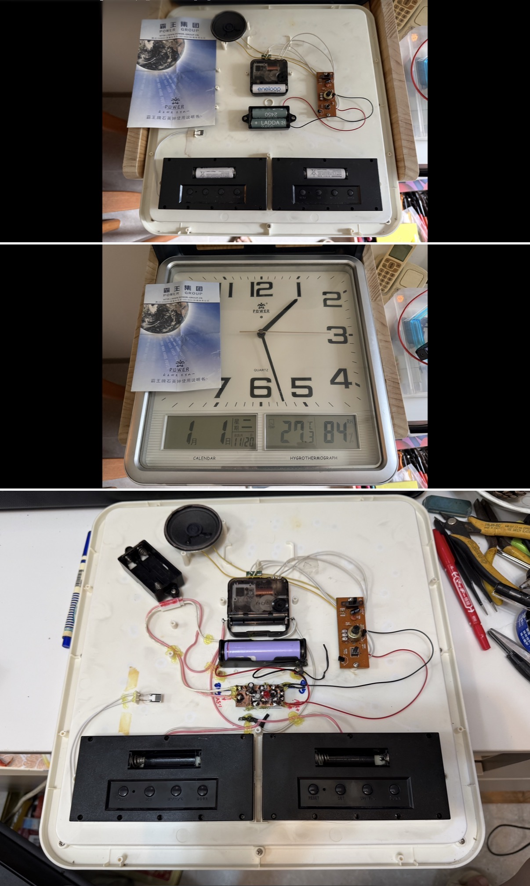
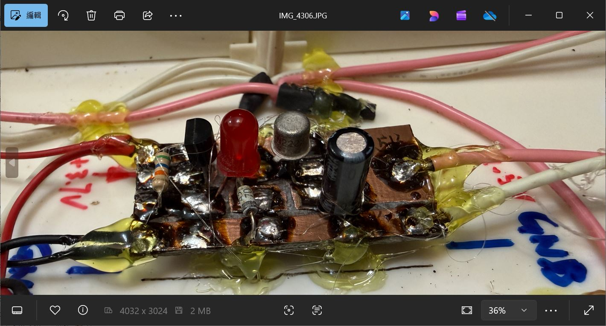

# LTspice_JFET_1.5V_Regulator
desk clock usually powered by 1.5V AA battery 800mAh, idle 0uA, clock movment 220uA ~ 300uA, try this regulator with Li-ion battery, typical 3.7V~4.2V

the LTspice simulation was done after circuit build and testing, it is perfectly matched to each other,   
  

### typical concerns  
4.2V battery will damages the clock ?  
power consumption ?
advantage ?

### AA battery vs Li-ion battery
AA battery, USD$0.4 of each, 800mAh, full year powering the clock
Li-ion battery, typical 18650 cells off from notebook battery pack dismissed, 1000~2000mAh, no payment is required  

### low cost Diode drop vs JFET_1.5V_Regulator  
Diode drop, simple, works but voltage is rippling under clocking loading  
JFET_1.5V_Regulator, ideal and works as well, a few more components and hungry 26uA constantly

### for fun and experiment  
no good, no bad, just fun and learning.
the clock movement itself is just about USD1 or less. exterior enclosure/humidometer/temperature/shelf payment/profit are not considered.

### testing rig
  
  
  

### LTspice source code, for educational purpose
[LTspice_JFET_1.5V_Regulator](LTspice_JFET_1.5V_Regulator)  

